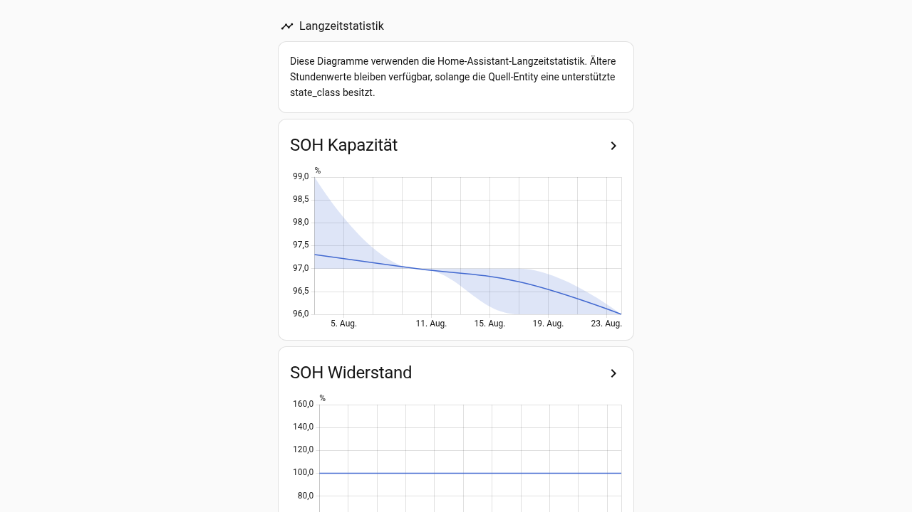
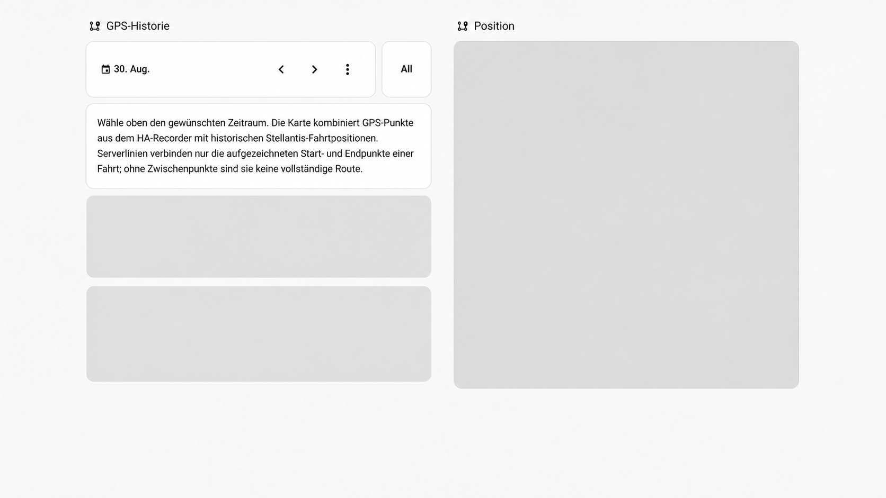
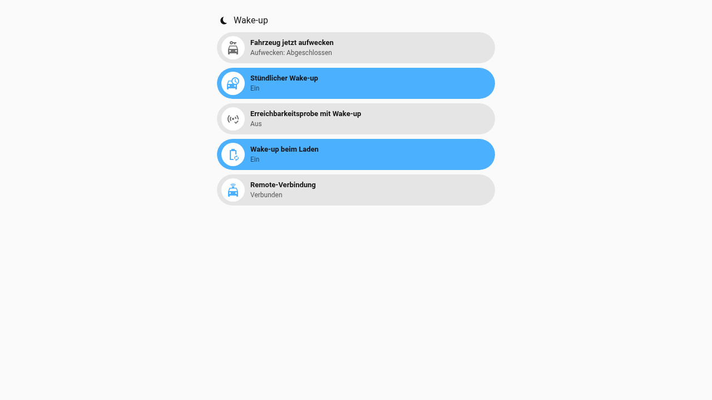

# Dashboard features

SV Dashboard is organized by task. Exact views and controls depend on the capabilities exposed by the selected Stellantis vehicle.

## Screenshots

The existing screenshots were captured from a real Home Assistant installation and anonymized. They remain valid as UI examples during the SV migration.










## Compact vehicle overview card

`custom:sv-dashboard-vehicle-overview-card` is the reusable compact presentation for another Home Assistant dashboard.

```yaml
type: custom:sv-dashboard-vehicle-overview-card
```

With multiple SV Dashboard entries, bind the card to a specific config entry with `entry_id`.

The generated LIVE hero uses the same canonical card implementation (`variant: live`).

See [Vehicle overview card](VEHICLE_OVERVIEW_CARD.md).

## Vehicle / LIVE

Vehicle / LIVE is the day-to-day cockpit. Depending on the selected vehicle it can show:

- vehicle picture;
- electric range/SOC or fuel state/range;
- contextual temperature/charging information;
- remote-connection state;
- preconditioning/remote quick actions where available;
- mileage;
- consumption/usage information;
- battery/SOH information where the vehicle exposes it;
- 12-V/service-battery information;
- current position;
- latest trip and charge;
- vehicle/maintenance information.

Unsupported electric/fuel sections remain hidden rather than showing invented values.

## Charging

Charging is shown only when the vehicle exposes relevant charging capabilities.

It can include:

- completed AC/DC sessions;
- start/end SOC;
- duration;
- energy when source data permits;
- average charging power when defensibly derivable;
- reconstructed SOC/time curves.

Derived power/energy values are estimates, not wallbox meter data.

## Statistics

Depending on available data, Statistics can include:

- mileage and driven distance;
- trailing consumption;
- fuel-consumption metrics;
- SOH capacity/resistance;
- Home Assistant long-term statistics.

SV Dashboard does not silently rewrite malformed stored LTS history. The dedicated LTS investigation is tracked in issue #4.

## Trips

Trips uses canonical Stellantis server history with:

- server-history refresh;
- filters;
- short/zero-distance handling;
- plausibility checks;
- continuity repair only when strong evidence exists.

Raw upstream values remain retained for diagnostics when a derived boundary is repaired.

Electric trip-energy columns appear only when electric data exists.

## GPS

GPS combines available Home Assistant Recorder points and canonical Stellantis history while keeping the current position separate from archived history.

Sparse points and straight server start/stop lines are expected when the upstream vehicle reports only occasional positions.

## Wake-up

Wake-up contains reachability controls such as:

- wake vehicle now;
- hourly wake-up;
- availability probe;
- wake-up while charging where relevant;
- remote-connection state.

A command marked `accepted` or `forwarded` is not treated as proof of fresh telemetry.

## Notifications

Notification controls are opt-in and capability-aware. The view can include:

- master switch;
- vehicle alerts;
- trip reports;
- charge reports for charging-capable vehicles;
- selected recipients;
- thresholds/delays;
- quiet hours;
- diagnostics;
- test notification.

Notify-service discovery never silently activates a recipient.

Focused runtime QA is tracked in issue #3.

## System

System contains integration/runtime administration rather than everyday vehicle status. It can include:

- setup/connection status;
- mapped upstream entities;
- privacy/data-sharing state;
- refresh interval;
- battery-value correction where applicable;
- ABRP controls/status where configured.

## Capability gating

SV Dashboard is not model-hardcoded.

- **Electric:** electric SOC/range/charging/battery analytics where available.
- **Hybrid:** electric and fuel features independently where available.
- **Thermic / combustion:** fuel features without electric-only charging/battery analytics.
- **Hydrogen / unknown:** only actual mapped capabilities are shown.

See [Vehicle capability matrix](VEHICLE_CAPABILITY_MATRIX.en.md).

## Multi-vehicle behavior

Each `sv_dashboard` config entry owns its selected upstream device, generated dashboard and package state. The frontend uses the explicit config-entry ID rather than localized entity IDs or dashboard ordering.

## Data quality and privacy

Direct upstream data and derived estimates are deliberately distinguished. SOC-derived energy, SOC/time charging power and sparse GPS geometry are never presented as meter-grade/live telemetry.

Before publishing screenshots or diagnostics, redact private VINs, account identifiers, GPS coordinates/locations, Notify recipient names, config-entry IDs, credentials and tokens.
