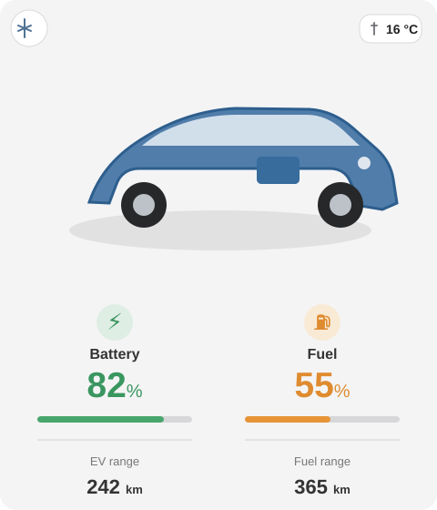
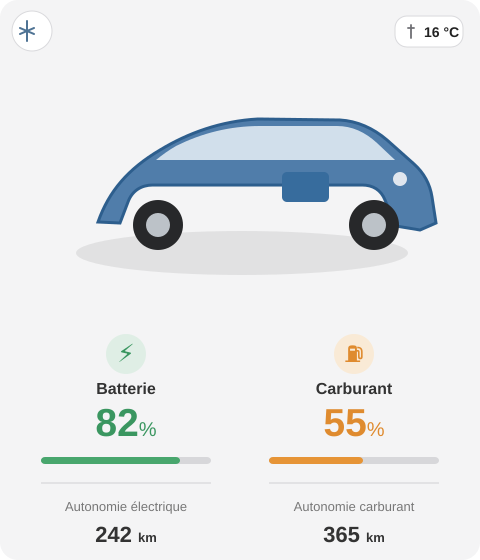

# Dual-Energy vehicle overview card

`custom:sv-dashboard-dual-energy-overview-card` is the wide native SV Dashboard card for vehicles that expose both electric and fuel data, especially PHEV/Hybrid vehicles.

It is also available from Home Assistant's normal **Add card** picker as the localized **SV vehicle overview – Dual Energy** entry. The compact universal vehicle overview remains a separate public card.

## Minimal configuration

```yaml
type: custom:sv-dashboard-dual-energy-overview-card
```

With more than one SV Dashboard config entry, select the vehicle in the card editor or bind the card to the corresponding `entry_id`.

## What the Hero shows

The card keeps the two energy domains deliberately separate:

| Vehicle state | Battery side | Fuel side |
| --- | --- | --- |
| Parked / idle | battery SOC and electric range | fuel level and fuel range |
| Driving | battery SOC and **current trip energy used in kWh** | fuel level and fresh instantaneous fuel consumption when the upstream entity is trustworthy |
| Charging | battery SOC and **current charge power** | fuel level / range remains available |

Important rules:

- `current_trip_energy` is an **absolute kWh value**, not kWh/100 km.
- Fuel consumption is shown only when the mapped upstream value is numeric, belongs to the current drive and is sufficiently fresh. A stale value is not presented as live consumption.
- Unknown or unsupported values stay neutral (`—`); the card does not invent Hybrid/EV values.
- Package-derived charging power and energy can be battery-side SOC/time estimates. They are not EVSE/grid meter readings and do not include charging losses.

## Native interactions

The production Hero uses native card interactions rather than nested `custom:button-card` instances:

- click the vehicle image → generated SV vehicle dashboard;
- click vehicle temperature → Home Assistant native **More Info** / recorded history;
- click Battery or Fuel percentage → native **More Info** for the mapped entity;
- click the current battery/fuel detail → native **More Info** for the metric currently being displayed;
- climate/preconditioning remains a direct package action where the upstream capability exists.

The native implementation replaced the temporary YAML/button-card interaction playground used during beta development.

## Localisation

The card and its editor use the shared SV Dashboard frontend localisation layer and follow the Home Assistant UI language automatically. An explicit card `language` override uses the same resolution path.

SV Dashboard currently ships the public frontend contract in 18 languages:

`de`, `en`, `fr`, `it`, `es`, `pt`, `nl`, `da`, `nb`, `sv`, `fi`, `pl`, `cs`, `sk`, `hu`, `ro`, `sl`, `hr`.

DE / EN / FR runtime switching was visually checked during beta.9 owner QA, including the longer French Hybrid labels.

## Documentation examples

The SVGs below are documentation renderings based on the owner beta.9 runtime screenshots and the approved post-beta.9 wording. They demonstrate layout and localisation without publishing private vehicle/location data.

### Deutsch


### English



### Français



## Building a different presentation

The SV Dashboard card is not the only way to present the data. The mapped Stellantis entities and the package-owned SV entities are normal Home Assistant data sources, so an advanced user can build a different Lovelace/YAML presentation for the same vehicle data.

A useful prototype contribution contains:

1. the YAML/custom-card configuration;
2. one or more screenshots;
3. which vehicle/powertrain state is being shown (parked, driving, charging, Hybrid fuel use, etc.);
4. the intended interaction or information hierarchy;
5. no VIN, exact location, account data or other private identifiers.

A well-defined custom prototype can be used as design input for a future package-owned feature. Sharing a prototype does not mean that every third-party card or layout will become a built-in dependency.

## Related documentation

- [Vehicle overview card](VEHICLE_OVERVIEW_CARD.md)
- [Dashboard features](DASHBOARD_FEATURES.md)
- [Localisation](LOCALISATION.en.md)
- [Vehicle capability matrix](VEHICLE_CAPABILITY_MATRIX.en.md)
